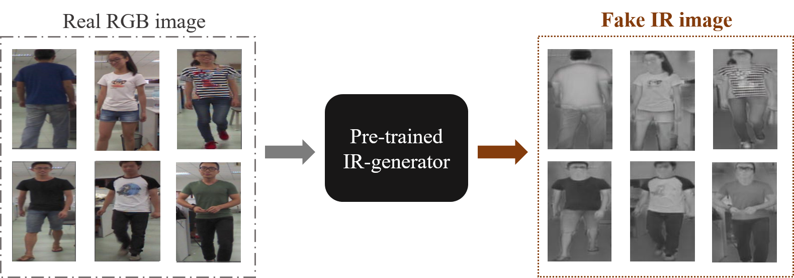
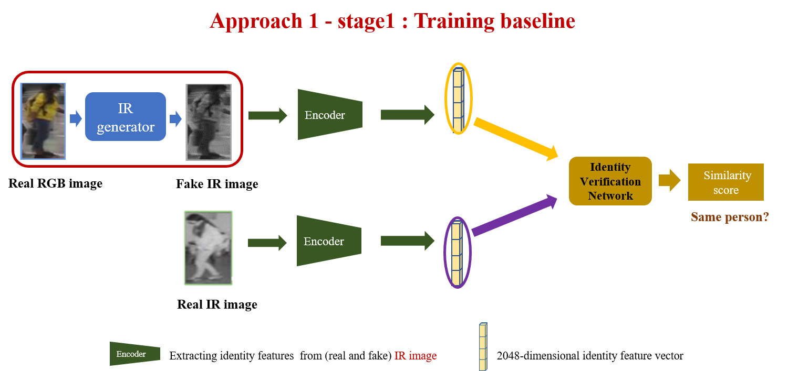

 
# RGB-IR Cross-Modality Person Re-Identification with Pose-transferred Image Generation


[JOO-HYE PARK](Department of Mechanical Engineering, Korea Advanced Institute of Science and Technology (KAIST), Daejeon 34141, South Korea (e-mail: weetweet720@gmail.com))\, [DONG-SOO KWON](Department of Mechanical Engineering, Korea Advanced Institute of Science and Technology (KAIST), Daejeon 34141, South Korea (e-mail: kwonds@kaist.ac.kr)\

Pytorch implementation for our master theis research. With the two-generator based proposed approah :  we are able to learn **identity-related** and **modality and pose-unrelated** representations.

## Prerequisites
- Python 3
- [Pytorch](https://pytorch.org/) (We run the code under version 0.3.1, maybe lower versions also work.)

## Getting Started
## RGB to IR image translation 
<p align="center"></p>
- In two separate generators-based approach, there is an IR generator that converts the modality from RGB to IR.
- The pixel alignment module of AlignGAN was utilized for IR generator.

### Installation
- Install dependencies (e.g., [visdom](https://github.com/facebookresearch/visdom) and [dominate](https://github.com/Knio/dominate)). You can install all the dependencies by:
```
pip install scipy, pillow, torchvision, sklearn, h5py, dominate, visdom
```
- Clone this repo:
```
git clone https://github.com/joohye720/fdgan_jh_approach1.git
cd fdgan_jh_approach1/
```

### Datasets
- The SYSU-MM01 dataset is an RGB-Infrared (IR) multi-modality pedestrian dataset for cross-modality person re-identification
- It contains both RGB images and IR images per one identity
- Pose landmarks is need for training, so we generate the pose files by [Realtime Multi-Person Pose Estimation](https://github.com/tensorboy/pytorch_Realtime_Multi-Person_Pose_Estimation). And the raw datasets have been preprocessed by the code in [open-reid](https://github.com/Cysu/open-reid). 
- Download the SYSU-MM01 datasets through the links below, and `unzip` them in the same root path.  
*SYSY-MM01*: [[dropbox]](https://www.dropbox.com/sh/v036mg1q4yg7awb/AABhxU-FJ4X2oyq7-Ts6bgD0a?dl=0) [[Baidu Pan]](http://pan.baidu.com/s/1gfIlcmZ)  


## Usage
The following training stages instruction is based on FDGAN training.


### Stage I: reID baseline pretraining

<p align="center">
	
We use a Siamese baseline structure based on `ResNet-50`. You can train the model with follow commands,
```
python baseline.py -b 256 -j 4 -d SYSY-MM01 -a resnet50 --combine-trainval \
					--lr 0.01 --epochs 100 --step-size 40 --eval-step 5 \
					--logs-dir /path/to/save/checkpoints/
```
You can train it on specified GPUs by setting `CUDA_VISIBLE_DEVICES`, and change the dataset name `[SYSY-MM01]` after `-d` to train models on different datasets.  

<a name="stageI"></a>And **test** them with follow commands,
```
python baseline.py -b 256 -d SYSY-MM01 -a resnet50 --evaluate --resume /path/of/model_best.pth.tar
```

	
### Stage II: FD-GAN pretraining

<p align="center"><approach1-stage2.png' width="600px">

We need to pretain FD-GAN with the image encoder part (*E* in the original paper and *net_E* in the code) fixed first. You can train the model with follow commands,
```
python train.py --display-port 6006 --display-id 1 \
	--stage 1 -d SYSY-MM01 --name /directory/name/of/saving/checkpoints/ \
	--pose-aug gauss -b 256 -j 4 --niter 50 --niter-decay 50 --lr 0.001 --save-step 10 \
	--lambda-recon 100.0 --lambda-veri 0.0 --lambda-sp 10.0 --smooth-label \
	--netE-pretrain /path/of/model_best.pth.tar
```
You can train it on specified GPUs by setting `CUDA_VISIBLE_DEVICES`. For main arguments,
- `--display-port`: display port of [visdom](https://github.com/facebookresearch/visdom), e.g., you can visualize the results by `localhost:6006`.
- `--display-id`: set `0` to disable [visdom](https://github.com/facebookresearch/visdom).
- `--stage`: set `1` for Stage II, and set `2` for stage III.
- `--pose-aug`: choose from `[no|erase|gauss]` to make augmentations on pose maps.
- `--smooth-label`: smooth the label of GANloss or not. 

Other arguments can be viewed in [options.py](https://github.com/yxgeee/FD-GAN/blob/master/fdgan/options.py).

**Notice**: 
If you use `visdom` for visualization by setting `--display-id 1`, you need to open a new window and run the script `python -m visdom.server -port=6006` before running the main program, where `-port` should be consistent with `--display-port`. 

### Stage III: Global finetuning

<p align="center"><approach1-stage3.png' width="600px">
	
Finetune the whole framework by optimizing all parts. You can train the model with follow commands,
```
python train.py --display-port 6006 --display-id 1 \
	--stage 2 -d SYSY-MM01 --name /directory/name/of/saving/checkpoints/ \
	--pose-aug gauss -b 256 -j 4 --niter 25 --niter-decay 25 --lr 0.0001 --save-step 10 --eval-step 5 \
	--lambda-recon 100.0 --lambda-veri 10.0 --lambda-sp 10.0 --smooth-label \
	--netE-pretrain /path/of/100_net_E.pth --netG-pretrain /path/of/100_net_G.pth \
	--netDi-pretrain /path/of/100_net_Di.pth --netDp-pretrain /path/of/100_net_Dp.pth
```
You can train it on specified GPUs by setting `CUDA_VISIBLE_DEVICES`.  
We trained this model on a setting of batchsize 256. If you don't have such or better hardware, you may decrease the batchsize (the performance may also drop).
And **test** `best_net_E.pth` by the same way as mentioned in [Stage I](#stageI).

## TODO
- generate IR images from RGB to IR image translation
- scripts for generate pose landmarks.
- generate specified images.


## Acknowledgements
Our code is inspired by [pytorch-CycleGAN-and-pix2pix](https://github.com/junyanz/pytorch-CycleGAN-and-pix2pix) and [open-reid](https://github.com/Cysu/open-reid) and FD-GAN(https://github.com/yxgeee/FD-GAN).
